<p align="center">
  
</p>

<h1 align="center">Applicability-Gated Molecular AI</h1>

<p align="center">
  <strong>Reproducibility repository for</strong><br/>
  <strong>Learning When to Trust Fallible Scientific Rules: Applicability-Gated Molecular Property Prediction under Chemical-Space Shift</strong>
</p>

<p align="center">
  <a href="docs/FROZEN_RESULTS.md"></a>
  <a href="https://github.com/SunilgarGusai/applicability-gated-molecular-ai/actions/workflows/validate-frozen-package.yml"></a>
  <a href="environment.yml"></a>
  <a href="data/sources.md"></a>
  <a href="CITATION.cff"></a>
  <a href="docs/LICENSE_AND_USAGE.md"></a>
  
</p>

<p align="center">
  <a href="#why-this-study">Why this study?</a> •
  <a href="#method-at-a-glance">Method</a> •
  <a href="#key-results">Key results</a> •
  <a href="#reproducibility">Reproducibility</a> •
  <a href="#result-to-source-map">Result map</a> •
  <a href="#citation">Citation</a>
</p>

---

## Why this study?

Scientific rules are attractive in AI because they are interpretable, but many useful scientific rules are **empirical rather than universally valid**. A rule can work well for one region of chemical space and fail badly in another; a flexible learned model can also become unreliable under distribution shift.

This repository accompanies a study of **Applicability-Gated Rule-Residual Learning (AGRR)**, which keeps an explicit scientific rule visible as a fallible expert instead of absorbing it invisibly into a latent representation.

> **Central question:** When should a learned molecular predictor trust an explicit scientific rule, when should it correct that rule, and how can those decisions remain auditable under chemical-space shift?

The study deliberately retains mixed and negative findings. In particular:

- the principal AGRR configuration uses three neural members while several comparators are single networks, so the main comparison does **not** isolate a causal gating effect;
- the Delaney ESOL equation has historical exposure to the source data underlying the ESOL benchmark;
- on BBBP, strong non-rule baselines and the shuffled-rule control remain competitive;
- external B3DB transfer shows a distinction between discrimination and calibration rather than universal AGRR superiority.

These are part of the scientific conclusion, not exceptions hidden from it.

## Method at a glance

For a molecule `x`, AGRR keeps the scientific-rule prediction `r(x)` explicit. Declared applicability `a(x)` and learned trust `t(x)` determine the realized rule reliance `ρ(x)`, while a graph-descriptor expert `nθ(x)` supplies the learned prediction.

<p align="center">
  
</p>

<p align="center">
  <sub>Animated path highlighting is decorative; the scientific workflow is unchanged. <a href="docs/assets/agrr-workflow.svg">Open the static high-resolution SVG</a>.</sub>
</p>

The rule-failure model is **separate** from the predictive path: it estimates likely rule error for retrospective auditing and selective analysis, but does not modify the frozen AGRR prediction.

## Study design

The frozen study uses five molecular data resources with distinct roles:

| Dataset | Role in the study |
|---|---|
| **ESOL** | Primary regression benchmark with the Delaney solubility rule |
| **BBBP** | Primary classification benchmark with a Clark-derived passive-diffusion prior |
| **FreeSolv** | No-rule sensitivity task |
| **Lipophilicity** | No-rule sensitivity task |
| **B3DB** | External BBB transfer after exact standardized-SMILES de-overlap against BBBP |

The primary **ESOL/BBBP** benchmark uses **five frozen seeds** (`20260711`, `20260719`, `20260727`, `20260804`, `20260812`) and three split families: random, Bemis-Murcko scaffold, and Butina similarity-cluster partitions. The **FreeSolv/Lipophilicity** no-rule sensitivity analysis uses the first three frozen seeds and random/scaffold splits only. **B3DB** is a separate external-transfer evaluation after exact standardized-SMILES de-overlap against BBBP. Molecular standardization and duplicate/conflict handling occur before splitting; preprocessing and rule transformations use training data only; calibration/model selection use validation data where applicable; test and external labels are not used during fitting.

See [`docs/EXPERIMENT_PROTOCOL.md`](docs/EXPERIMENT_PROTOCOL.md) for the complete frozen protocol.

## Key results

The repository exposes the manuscript-supporting aggregate outputs directly. Selected results are summarized below to make the repository immediately navigable; they should be interpreted together with the study limitations.

| Evidence | Frozen result | Interpretation |
|---|---:|---|
| **ESOL scaffold RMSE** | Fixed rule **1.121 ± 0.035**; fusion **0.804 ± 0.093**; AGRR **0.737 ± 0.054** | AGRR is lower in the frozen comparison, but ensemble size and historical rule-data overlap prevent a gating-only interpretation |
| **BBBP AGRR AUROC** | Random **0.920**; scaffold **0.913**; Butina **0.885** | Strong baselines and shuffled-rule controls constrain any knowledge-specific claim |
| **Rule-failure diagnosis** | Spearman **0.409-0.592** (ESOL), **0.720-0.799** (BBBP) | The separately trained failure score ranks held-out rule error |
| **Selective rule audit** | Retaining the 50% lowest predicted-failure molecules lowers observed mean rule error by **22-38%** | Useful retrospective ranking signal; not a validated deployment threshold |
| **External B3DB** | Extra Trees AUROC **0.907**; AGRR ECE **0.047** | Best observed discrimination and best observed calibration belong to different models |

### A negative-control result worth keeping visible

On BBBP, the shuffled-rule control is approximately as strong as the genuine-rule AGRR configuration across the three split families. This is why the study does **not** claim that the Clark-derived score provides a consistent knowledge-specific discrimination advantage. The repository preserves that result rather than optimizing the narrative around favourable comparisons.

## Frozen data lineage and provenance

Raw third-party molecular datasets are intentionally **not redistributed** here. Instead, the repository provides source information, retrieval notes, audit counts, and SHA-256 checksums.

- [`data/sources.md`](data/sources.md) — source locations and retrieval notes
- [`data/checksums.csv`](data/checksums.csv) — checksums for frozen source files
- [`data/manifests/`](data/manifests/) — dataset/reference audit manifests
- [`docs/DATA_PROVENANCE.md`](docs/DATA_PROVENANCE.md) — provenance narrative

The B3DB transfer set contains **6,049 molecules** after exact standardized-SMILES overlap removal against cleaned BBBP. Exact-SMILES de-overlap does not imply complete chemical-series independence.

## Reproducibility

The public repository is designed as an **auditable frozen-result package**, not as a loose code dump.

It contains:

1. molecular standardization and split-generation code;
2. descriptor/fingerprint/graph preparation code;
3. explicit-rule and AGRR model components;
4. baseline models and negative controls;
5. uncertainty/calibration and selective-prediction analyses;
6. rule-failure diagnostics;
7. external B3DB transfer analysis;
8. machine-readable frozen results supporting manuscript tables and figures;
9. artifact-validation and regeneration helpers;
10. source/provenance/checksum records.

### Environment

The repository environment is specified in [`environment.yml`](environment.yml) and [`requirements.txt`](requirements.txt). The conda specification currently targets:

- Python 3.13
- NumPy 2.3
- pandas 2.2
- SciPy 1.17
- scikit-learn 1.8
- RDKit 2025.09
- PyTorch 2.10
- PyTorch Geometric 2.8
- XGBoost 3.1

```bash
conda env create -f environment.yml
conda activate agrr-molecular-ai
```

### Validate the frozen package

```bash
python scripts/validate_frozen_package.py
```

### Inspect artifact-regeneration support

```bash
python scripts/regenerate_manuscript_artifacts.py --help
```

The repository does **not** advertise a fabricated one-command historical retraining command. The frozen archive does not contain every original checkpoint, per-member prediction, row-level exclusion ledger, or original split-assignment manifest needed for byte-identical replay of the historical run. See [`docs/REPRODUCIBILITY.md`](docs/REPRODUCIBILITY.md).

## Result-to-source map

| Manuscript evidence | Machine-readable repository source |
|---|---|
| ESOL model/split RMSE summary | [`results/frozen/main_metrics/esol_rmse_summary.csv`](results/frozen/main_metrics/esol_rmse_summary.csv) |
| BBBP model/split AUROC summary | [`results/frozen/main_metrics/bbbp_auroc_summary.csv`](results/frozen/main_metrics/bbbp_auroc_summary.csv) |
| Uncertainty and calibration summary | [`results/frozen/uncertainty/uncertainty_summary.csv`](results/frozen/uncertainty/uncertainty_summary.csv) |
| Descriptor-explanation repeatability | [`results/frozen/uncertainty/explanation_stability.csv`](results/frozen/uncertainty/explanation_stability.csv) |
| Rule-failure diagnostic summary | [`results/frozen/statistical_outputs/failure_diagnostics_summary.csv`](results/frozen/statistical_outputs/failure_diagnostics_summary.csv) |
| Paired seed-level comparisons | [`results/frozen/statistical_outputs/paired_bootstrap_recomputation.csv`](results/frozen/statistical_outputs/paired_bootstrap_recomputation.csv) |
| External B3DB evaluation | [`results/frozen/external_validation/external_b3db_results.csv`](results/frozen/external_validation/external_b3db_results.csv) |
| Full frozen-result inventory | [`docs/FROZEN_RESULTS.md`](docs/FROZEN_RESULTS.md) |

## Repository structure

```text
.
├── config/                     # frozen experiment configuration
├── data/                       # source manifests, checksums and audit summaries
│   └── manifests/              # dataset/reference audit manifests
├── docs/                       # protocol, provenance and reproducibility notes
│   └── assets/                 # README visual assets
├── results/
│   └── frozen/                 # aggregate manuscript-supporting outputs
│       ├── ablations/
│       ├── external_validation/
│       ├── main_metrics/
│       ├── statistical_outputs/
│       └── uncertainty/
├── scripts/                    # validation / artifact-regeneration helpers
├── src/                        # research pipeline source code
├── tables/                     # machine-readable table sources
├── CITATION.cff
├── environment.yml
├── requirements.txt
└── REPOSITORY_MANIFEST.csv
```

## Scientific scope and limitations

This repository should be read as evidence for a **trustworthy / knowledge-guided AI methodology study demonstrated in molecular-property prediction**. It is not evidence that AGRR is universally more accurate than classical molecular models or unrestricted neural predictors.

Important boundaries include:

- unequal ensemble sizes in the principal neural comparison;
- historical dependence between the Delaney ESOL rule and the source benchmark data;
- only one principal explicit rule per primary task;
- empirical rather than mechanistic applicability scoring;
- approximate ensemble uncertainty and post-hoc calibration;
- shuffled-rule BBBP results that limit a knowledge-specific interpretation;
- exact-SMILES external de-overlap rather than proof of total chemical independence;
- no validated operational safety, review, or abstention threshold.

## Release status

**Current status: manuscript submission repository.**  
The repository is aligned with the frozen submission evidence. Publication metadata and a DOI can be added to `CITATION.cff` after publication. A repository-wide software license is intentionally **not asserted yet** because code ownership/provenance has not been independently confirmed for public relicensing; see [`docs/LICENSE_AND_USAGE.md`](docs/LICENSE_AND_USAGE.md).

## Authors

- **Sunilgar L. Gusai** — corresponding author, Faculty of Computer Applications, Marwadi University  
  ORCID: [0009-0004-0739-4812](https://orcid.org/0009-0004-0739-4812)
- **Manoharsinh R. Jadeja** — Department of Artificial Intelligence, Machine Learning and Data Science, Marwadi University
- **Vinodray J. Kaneria** — Department of Mathematics, Saurashtra University

## Citation

Citation metadata are provided in [`CITATION.cff`](CITATION.cff).

If you use this repository, code, or frozen research outputs, please cite the associated manuscript when bibliographic publication metadata become available.

## License and usage

Original repository content currently has **no repository-wide open-source license assertion**. Third-party datasets retain their original source terms and are not redistributed here. Full details are in [`docs/LICENSE_AND_USAGE.md`](docs/LICENSE_AND_USAGE.md).